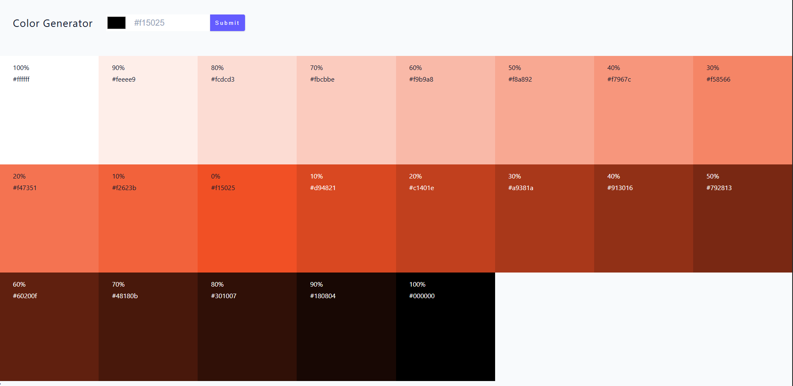

# Color Generator App

This project is a React-based color generator application built to demonstrate and apply key concepts in React development, including controlled inputs, state management for form data, integration with third-party libraries, and interaction with the Web Clipboard API.

## Learning Objectives Applied

### Controlled Inputs and State Management

- **Controlled Inputs**: Implemented form inputs where the value is controlled by React state, ensuring that the component's state is the single source of truth for input data.
- **State Values for Form Control**: Used React's `useState` hook to manage input values, handle changes, and validate form submissions, providing a seamless user experience with real-time updates.

### React-Toastify

- Integrated React-Toastify for user notifications, displaying success and error messages during color generation and form validation, enhancing user feedback without disrupting the UI flow.

### Values.js Library

- Utilized the Values.js library to generate color palettes from a base color, including tints and shades. This library was used to create a list of colors with varying weights, demonstrating how to incorporate external libraries for color manipulation.

### Web Clipboard API

- Implemented clipboard functionality in the SingleColor component to allow users to copy hex color values to the clipboard with a single click, leveraging the modern Web Clipboard API for better accessibility and user convenience.

## Features

- **Color Input Form**: Users can input a base color using a color picker or text input.
- **Color Palette Generation**: Generates a palette of 10 colors (tints and shades) based on the selected color.
- **Interactive Color Display**: Each color in the palette displays its hex value and weight, with clickable functionality to copy to clipboard.
- **Toast Notifications**: Provides feedback for successful operations and errors (e.g., invalid color input).
- **Responsive Grid Layout**: Colors are displayed in a responsive grid that adapts to different screen sizes.

## UI Screenshot



## Technologies Used

- React
- Vite (for build tooling)
- Values.js (for color generation)
- React-Toastify (for notifications)
- Web Clipboard API

## Installation and Setup

1. Clone the repository and navigate to the project directory.
2. Install dependencies:
   ```sh
   npm install
   ```
3. Start the development server:
   ```sh
   npm run dev
   ```

## Project Structure

- `src/App.jsx`: Main application component handling state and color generation.
- `src/Components/Form.jsx`: Form component for user input.
- `src/Components/ColorList.jsx`: Component to render the list of generated colors.
- `src/Components/SingleColor.jsx`: Individual color component with copy-to-clipboard functionality.

This project serves as a practical application of React fundamentals and modern web APIs, showcasing how to build interactive, user-friendly interfaces with external library integrations.
